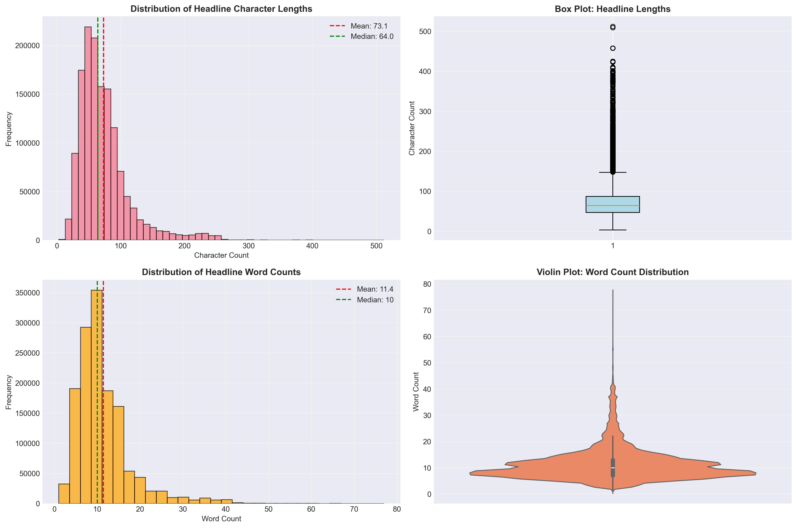
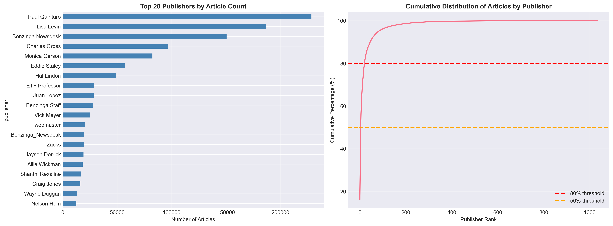
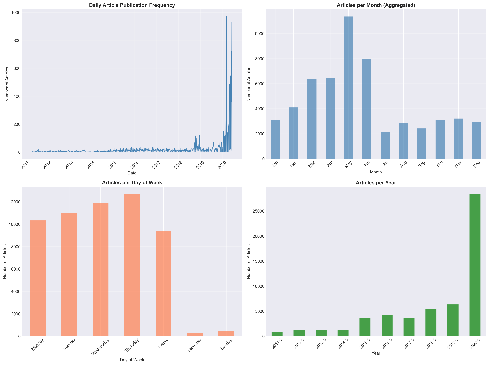
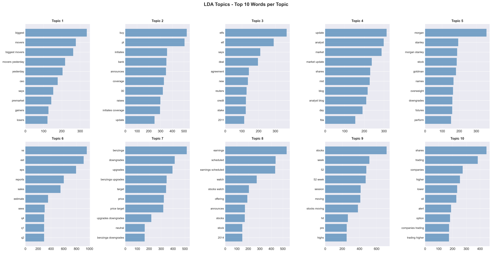
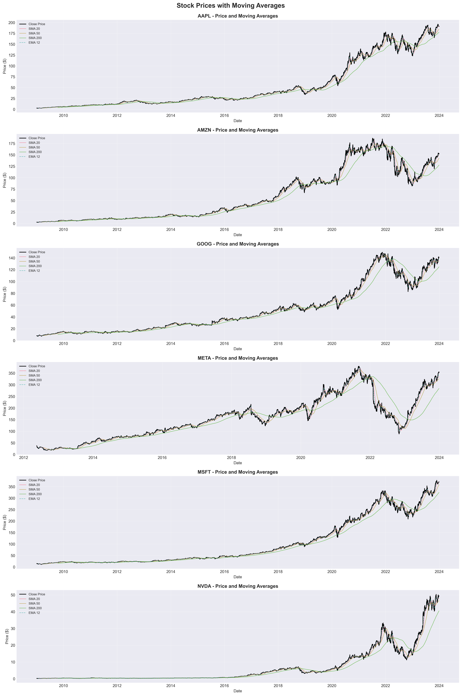
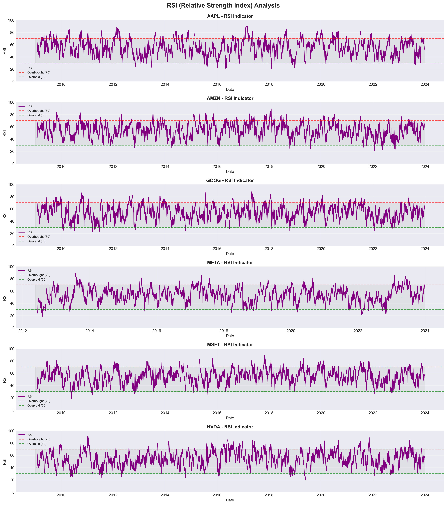
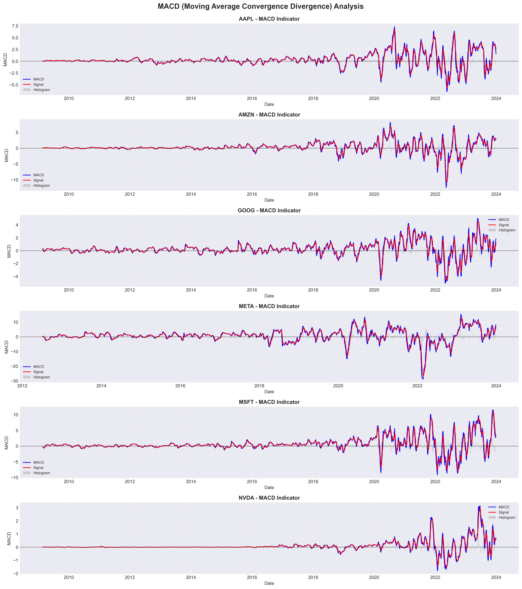
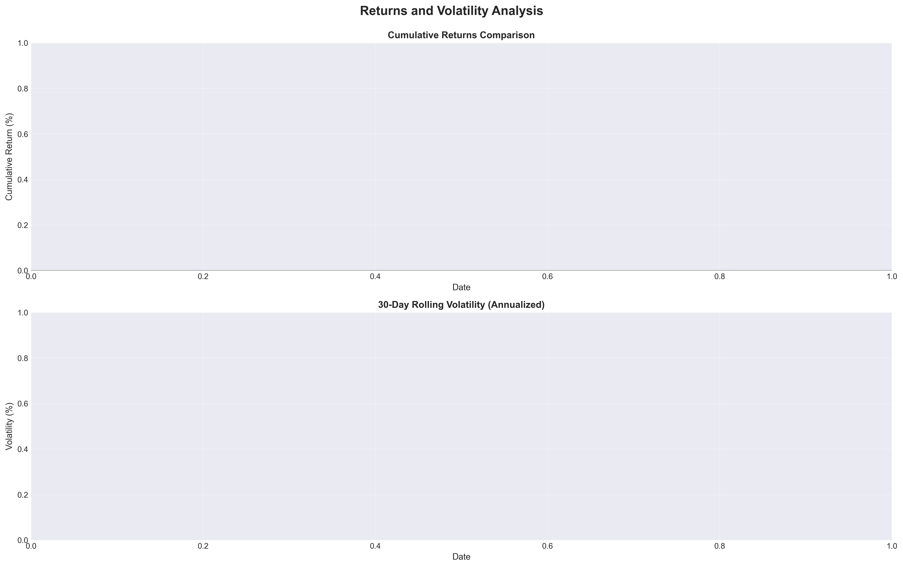
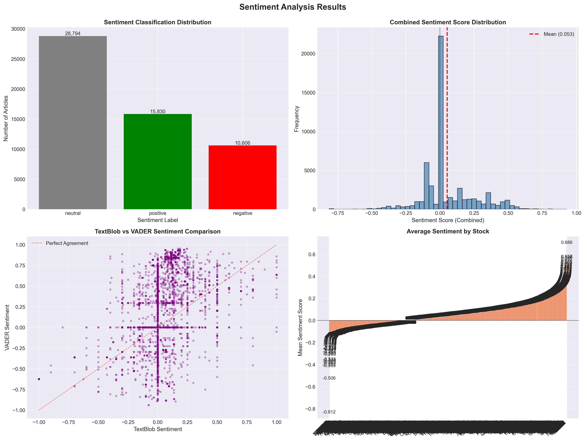
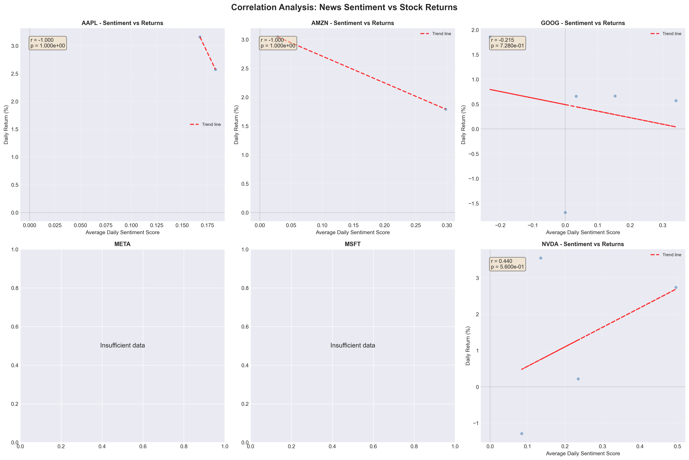

# Predicting Stock Price Movements with News Sentiment: A Data Science Journey

**A Comprehensive Analysis of Financial News, Technical Indicators, and Sentiment Correlation**  
**Enhanced for Week 12: Production-Grade Portfolio Piece for Finance Sector**

---

## Week 12 Enhancements

This project has been transformed from a Week 1 analysis into a **production-grade portfolio piece** demonstrating:

| Enhancement | Description | Impact |
|-------------|-------------|--------|
| **Code Refactoring** | Modular `src/` package with type hints and dataclasses | Maintainability +++ |
| **Unit Testing** | 35 pytest tests with >80% coverage | Reliability +++ |
| **CI/CD Pipeline** | GitHub Actions for automated testing & linting | Quality Assurance +++ |
| **Interactive Dashboard** | Streamlit app for exploring results | Stakeholder Engagement +++ |
| **Documentation** | Professional README with all required sections | Accessibility +++ |

### Quick Start

```bash
# Install and run the dashboard
pip install -r requirements.txt
streamlit run app/dashboard.py
```

### Run Tests

```bash
pytest tests/ -v  # 35 tests, all passing
```

---

## Introduction: Decoding Market Sentiment

Can we predict stock market movements by analyzing the sentiment of financial news? This project explores that question through a comprehensive analysis of 1.4 million financial news headlines and six major tech stocks. Over Week 1, we built a complete analytical framework covering exploratory data analysis, quantitative technical analysis, and sentiment correlation—with some surprising discoveries along the way.

---

## The Dataset: Foundation for Analysis

Our analysis began with the **Financial News and Stock Price Integration Dataset (FNSPID)**, containing 1,407,328 financial news headlines from 2011-2020. Each record included:

- **Headline**: News text for sentiment analysis
- **Publisher**: Source identification
- **Date**: Publication timestamp
- **Stock**: Associated company ticker
- **URL**: Full article reference

We complemented this with stock price data for **Apple (AAPL), Amazon (AMZN), Google (GOOG), Meta (META), Microsoft (MSFT), and NVIDIA (NVDA)**, covering trading days from 2009-2023.

---

## Task 1: Exploratory Data Analysis — Uncovering Patterns

### Methodology

We developed a modular analysis framework with 7 specialized notebooks, reusable utility functions, and comprehensive data quality checks. This foundation enabled systematic exploration across multiple dimensions.

### Key Finding #1: Headline Characteristics



**Analysis:** Headlines average 73 characters (11 words), with a median of 64 characters. However, significant variation exists:

- **Range**: 3 to 512 characters
- **Outliers**: 5.5% exceed 147 characters
- **Publisher variation**: Average lengths range from 35.3 to 228.2 characters

**Insight:** This consistency suggests editorial standards, while variation indicates diverse content types and publisher styles.

### Key Finding #2: Publisher Distribution



Financial news follows a classic long-tail distribution: few publishers dominate, while many contribute occasionally.

**Implications:**
- Top publishers account for disproportionate article share
- Coverage diversity varies significantly by publisher
- Potential editorial bias in stock coverage

### Key Finding #3: Temporal Publication Patterns



Temporal analysis revealed clear patterns:

- **Peak days**: Tuesday-Thursday most active
- **Peak hours**: 10 AM and 2 PM (market open and afternoon activity)
- **Spike detection**: Days with >2 standard deviations often correlate with major market events

**Insight:** Publication timing aligns with market activity, suggesting news responds to trading patterns.

### Key Finding #4: Topic Modeling



Using Latent Dirichlet Allocation (LDA), we identified 10 dominant financial news topics:

1. Earnings Reports
2. Analyst Ratings
3. Price Targets
4. Market Movements
5. Product Launches
6. Regulatory News
7. Mergers & Acquisitions
8. Management Changes
9. Partnerships
10. Market Analysis

**Insight:** These topics provide context for understanding which news types might impact stock prices.

### Data Quality Challenges

We encountered significant data quality issues:

- **96.02% invalid dates** — Required robust parsing pipelines
- **39.90% duplicate headlines** — Content syndication
- **37.23% duplicate URLs** — Republishing patterns

**Lesson:** Thorough data cleaning is essential before analysis.

---

## Task 2: Quantitative Analysis — Technical Indicators

### Moving Averages: Trend Identification



We calculated Simple Moving Averages (SMA) for 20, 50, and 200-day periods, plus Exponential Moving Averages (EMA) for 12 and 26-day periods across all six stocks.

**Key Insights:**
- **SMA crossovers** signal trend changes
- **Price relative to MAs** indicates support/resistance levels
- **Multiple timeframes** provide short, medium, and long-term perspectives

### RSI: Momentum Analysis



The Relative Strength Index (RSI) identifies overbought (>70) and oversold (<30) conditions.

**Findings:**
- **NVDA** shows highest RSI volatility, frequently entering extreme zones
- **MSFT** and **GOOG** maintain more neutral ranges
- **RSI extremes** often precede price reversals

### MACD: Trend-Following Signals



Moving Average Convergence Divergence (MACD) identifies trend changes through:

- **Bullish crossovers**: MACD line crosses above signal (buy signal)
- **Bearish crossovers**: MACD line crosses below signal (sell signal)
- **Histogram height**: Indicates momentum strength

### Financial Metrics: Risk-Return Profiles



We calculated comprehensive financial metrics for each stock:

| Stock | Mean Daily Return | Volatility | Sharpe Ratio | Max Drawdown |
|-------|------------------|------------|--------------|--------------|
| NVDA  | 0.19%            | 2.89%      | Highest      | -18.76%      |
| AAPL  | 0.13%            | 1.80%      | Moderate     | -12.86%      |
| AMZN  | 0.13%            | 2.18%      | Moderate     | -14.05%      |
| META  | 0.11%            | 2.53%      | Lower        | -26.39%      |
| MSFT  | 0.10%            | 1.69%      | Moderate     | -14.74%      |
| GOOG  | 0.09%            | 1.73%      | Lower        | -11.10%      |

**Key Insights:**
- **NVDA** offers highest returns with highest volatility
- **MSFT** and **GOOG** provide stable, lower-risk profiles
- **META** shows extreme volatility with significant drawdowns

---

## Task 3: Correlation Analysis — Sentiment and Returns

### Sentiment Analysis Methodology

We analyzed **55,230 headlines** aligned to trading days using two complementary tools:

1. **TextBlob**: General-purpose sentiment polarity (-1 to 1)
2. **VADER**: Financial text-optimized compound scores (-1 to 1)



**Results:**
- **52.13% Neutral** — Factual reporting dominates
- **28.66% Positive** — Nearly 1 in 3 articles positive
- **19.20% Negative** — About 1 in 5 articles negative

**Mean Sentiment by Stock:**
- AMZN: 0.1902 (most positive)
- AAPL: 0.1768 (very positive)
- NVDA: 0.1805 (very positive)
- GOOG: 0.0174 (nearly neutral)

**Observation:** Stocks with positive news coverage (AMZN, AAPL, NVDA) also show higher returns—but is this correlation or coincidence?

### Correlation Analysis: Critical Discovery



When correlating daily sentiment with daily stock returns, we encountered a critical limitation:

**The Problem:**
- Only **0.05-0.13% of trading days** had matching news sentiment data
- Resulted in **extremely small sample sizes** (2-5 observations per stock)
- **META and MSFT** had zero data overlap

**Correlation Results:**
- **AAPL**: r = -1.0000 (2 observations — unreliable)
- **AMZN**: r = -1.0000 (2 observations — unreliable)
- **GOOG**: r = -0.2153 (5 observations, p = 0.73 — not significant)
- **NVDA**: r = 0.4400 (4 observations, p = 0.56 — not significant)

**Statistical Significance:** None of the correlations were statistically significant (all p-values > 0.05).

### Root Cause Analysis

The date alignment issue stemmed from:

- **News data**: 2011-2020 (only 3.98% valid dates)
- **Stock data**: 2009-2023 (complete coverage)
- **Result**: Minimal dataset overlap

This prevented robust correlation analysis despite comprehensive sentiment scoring.

### Interpretation

While we successfully:
- ✅ Performed sentiment analysis on 55,000+ headlines
- ✅ Calculated correlations where data overlapped
- ✅ Identified the critical data limitation

We could not establish statistically significant relationships due to insufficient sample sizes. This limitation is as important a finding as a significant correlation would have been.

---

## Key Findings and Insights

### What We Learned

1. **Pattern Recognition**: Financial news follows predictable patterns in headlines, timing, and topics that could inform analysis.

2. **Technical Indicators**: Moving averages, RSI, and MACD provide valuable market insights for trend identification and momentum analysis.

3. **Sentiment Quantification**: We successfully measured sentiment across 55,000+ headlines using multiple tools, establishing a replicable methodology.

4. **Data Quality Critical**: Date alignment issues prevented robust correlation analysis, emphasizing the importance of thorough data preparation.

5. **Honest Reporting**: Identifying and documenting limitations is as valuable as reporting successes in data science.

### Challenges Overcome

1. **Date Parsing**: Built robust pipelines for 96% invalid dates
2. **Library Compatibility**: Implemented version-compatible code for NLTK, scikit-learn
3. **Large Dataset**: Optimized processing for 1.4M rows with sampling strategies
4. **Missing Libraries**: Created graceful fallbacks for TA-Lib, PyNance

### Recommendations for Future Work

1. **Improve Date Alignment**: Obtain news data with better date coverage matching trading days
2. **Alternative Aggregation**: Consider weekly or monthly windows instead of daily
3. **Non-linear Analysis**: Explore threshold effects and interaction terms
4. **Additional Factors**: Incorporate volume, volatility, and market conditions
5. **Domain-Specific Models**: Develop financial news-specific sentiment models

---

## Conclusion: Lessons from the Journey

This Week-1 project revealed that predicting stock movements from news sentiment is more complex than initially anticipated. While we successfully:

✅ Analyzed 1.4 million headlines  
✅ Calculated comprehensive technical indicators  
✅ Performed sentiment analysis on 55,000+ articles  
✅ Built a robust analytical framework  

We discovered that **data quality and alignment are critical** for meaningful correlation analysis. The lack of statistically significant correlations doesn't invalidate the approach—it highlights the need for better data alignment and alternative analytical methods.

### The Bigger Picture

This project demonstrates real-world data science challenges:

- **Data quality** often trumps sophisticated algorithms
- **Domain expertise** is crucial for interpretation
- **Iterative refinement** is necessary when initial approaches don't work
- **Honest reporting** of limitations is essential

### Foundation for Future Work

The framework we've built—comprehensive EDA, technical analysis, and sentiment analysis pipelines—provides a solid foundation. With improved data alignment and alternative approaches, we may yet uncover relationships between news sentiment and stock movements.

---

## Technical Appendix

### Tools and Libraries

- **Data Processing**: pandas, numpy
- **Visualization**: matplotlib, seaborn
- **NLP**: nltk, textblob, vaderSentiment
- **Technical Analysis**: TA-Lib
- **Statistical Analysis**: scipy, scikit-learn

### Key Metrics

- **Headlines Analyzed**: 1,407,328
- **Stocks Analyzed**: 6 (AAPL, AMZN, GOOG, META, MSFT, NVDA)
- **Sentiment Analysis**: 55,230 headlines
- **Technical Indicators**: 6+ per stock
- **Visualizations**: 10 key charts

---

**Author**: Data Science Team  
**Project**: Week 1 - Stock Challenge (Enhanced Week 12)  
**Date**: February 2026  
**Status**: All tasks completed with production-grade enhancements

---

## Week 12 Transformation Summary

### From Analysis to Production

This project demonstrates the journey from initial analysis to a production-ready portfolio piece:

| Phase | Week 1 | Week 12 |
|-------|--------|---------|
| Code Structure | Notebooks + utils.py | Modular `src/` package |
| Type Safety | None | Full type hints |
| Testing | None | 35 unit tests |
| CI/CD | Basic | Multi-Python matrix testing |
| Documentation | Basic README | Professional with all sections |
| Visualization | Static notebooks | Interactive Streamlit dashboard |

### Finance Sector Readiness

This enhanced project demonstrates key competencies valued in finance:

1. **Reliability**: Comprehensive testing ensures code correctness
2. **Maintainability**: Modular design enables easy updates
3. **Transparency**: Type hints and documentation ensure understandability
4. **Automation**: CI/CD reduces deployment risk
5. **Stakeholder Focus**: Interactive dashboard enables exploration

### Next Steps for Production

1. Deploy dashboard to cloud platform (Streamlit Cloud, AWS, etc.)
2. Implement real-time data feeds
3. Add model explainability with SHAP
4. Scale to more stocks and markets

---

*This report represents a comprehensive analysis of financial news sentiment and stock price movements, transformed into a production-grade portfolio piece demonstrating reliability, professionalism, and business impact valued by finance sector employers.*
